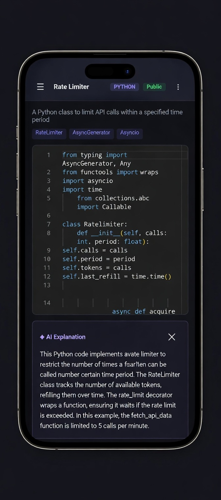
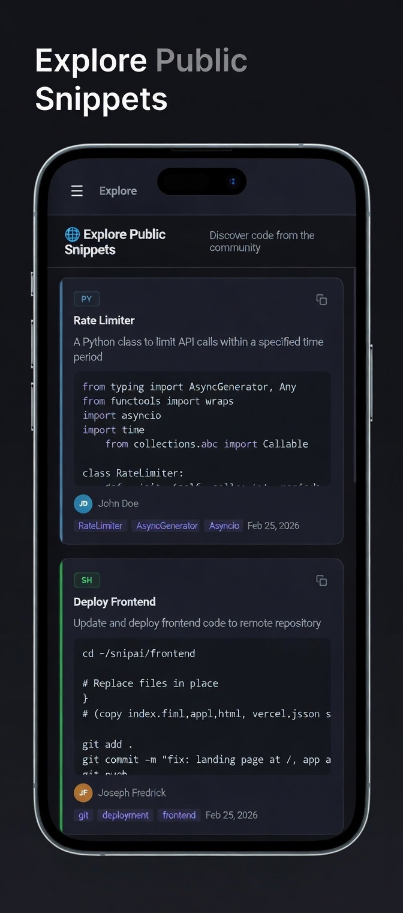
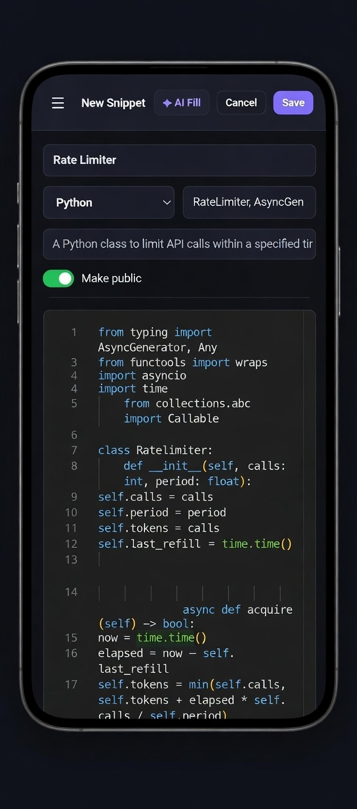

<div align="center">

  # ⚡ SnipAI

  ### AI-powered code snippet manager

  **Save. Organise. Understand your code — instantly.**

  [](https://getsnipai.vercel.app)
  [](LICENSE)
  [](https://termux.dev)

</div>

---

## 🎯 What is SnipAI?

SnipAI is a code snippet manager with an AI twist — paste any code and click **AI Fill**. It automatically names the snippet, detects the language, writes a description, and generates tags in under 2 seconds.

No more unnamed `untitled.js` files. No more digging through Notion pages. Your snippets, finally organised.

> 💡 **The backstory:** SnipAI was built entirely on an Android phone using Termux, Acode Editor, and Kiwi Browser. No laptop. No desktop. That constraint made the product genuinely mobile-first — which most developer tools aren't.

---

## ✨ Features

| Feature | Description |
|---------|-------------|
| ⚡ **AI Fill** | Paste code → AI names it, tags it, and describes it in ~2 seconds |
| 💬 **AI Explain** | Plain-English breakdown of any snippet in under 120 words |
| 🔍 **Instant Search** | Full-text search across all snippets by title, tags, or language |
| 🔒 **Private by Default** | Every snippet is private until you choose to share it |
| 🌐 **Explore Feed** | Browse public snippets from the community, filter by language |
| 📱 **Installable PWA** | Works offline, installs like a native app on any device |
| 🎨 **Monaco Editor** | Full syntax highlighting for 10+ languages |
| 🔑 **Your Own AI Key** | Bring your own Groq API key — no shared limits, completely free |

---

## 📸 Screenshots

|  |  |  |

<div align="center">

  | AI Fill | Explore Feed | AI Explanation |
  |---------|-------------|----------------|
  | Paste code, AI fills everything | Browse community snippets | Understand any code instantly |

</div>

---

## 🛠 Tech Stack

| Layer | Technology |
|-------|-----------|
| **Frontend** | Vanilla JS, Monaco Editor (CDN) |
| **Auth & Database** | [Appwrite](https://appwrite.io) (free tier) |
| **Hosting** | [Vercel](https://vercel.com) (free tier) |
| **AI** | [Groq](https://groq.com) — LLaMA 3.3 70B |
| **Editor** | Monaco Editor via CDN |
| **PWA** | Service Worker, Web App Manifest |
| **Built with** | Termux + Acode + Kiwi Browser on Android |

> No framework. No bundler. No build step. Just files — intentionally.

---

## 🚀 Getting Started

### Try it instantly
👉 **[getsnipai.vercel.app](https://getsnipai.vercel.app)** — free, no credit card

### Self-host in 5 minutes

**1. Clone the repo**
```bash
git clone https://github.com/codingrot17/snipai-frontend.git
cd snipai-frontend
```

**2. Set up Appwrite**
- Create a free account at [appwrite.io](https://appwrite.io)
- Create a project and database
- Create a `snippets` collection with these attributes:

| Attribute | Type | Size | Required |
|-----------|------|------|----------|
| `title` | String | 255 | Yes |
| `language` | String | 50 | Yes |
| `code` | String | 65535 | Yes |
| `description` | String | 500 | No |
| `tags` | String | 255 | No |
| `isPublic` | Boolean | — | No |
| `authorName` | String | 255 | No |
| `userId` | String | 255 | Yes |

- Set collection permissions: **Users can read/write their own documents**
- Enable **Email/Password** auth in Appwrite Auth settings

**3. Configure the app**
Open `appwrite.js` and update:
```js
const PROJECT_ID  = 'your_project_id';
const DATABASE_ID = 'your_database_id';
const COLLECTION_ID = 'your_collection_id';
const APPWRITE_ENDPOINT = 'https://cloud.appwrite.io/v1';
```

**4. Deploy to Vercel**
```bash
# Install Vercel CLI
npm i -g vercel

# Deploy
vercel --prod
```

**5. Add your Groq API key**
- Get a free key at [console.groq.com](https://console.groq.com)
- Open SnipAI → Settings → paste your key → Save

That's it. Full AI-powered snippet manager running for free.

---

## 📁 Project Structure

```
snipai-frontend/
├── index.html        # Landing page (public-facing)
├── app.html          # Main app shell
├── app.js            # Core app logic (CRUD, search, UI)
├── appwrite.js       # Appwrite service layer (auth, db)
├── auth.js           # Auth UI (login, register, OAuth)
├── explore.js        # Public explore feed
├── style.css         # Main styles
├── auth.css          # Auth screen styles
├── explore.css       # Explore feed styles
├── sw.js             # Service worker (offline PWA)
├── manifest.json     # PWA manifest
├── vercel.json       # Vercel routing config
└── icons/            # PWA icons
```

---

## 🤝 Contributing

Contributions are welcome. This is an open project built by one developer on a phone — any improvement helps.

```bash
# Fork the repo, then:
git checkout -b feature/your-feature
git commit -m "feat: your feature"
git push origin feature/your-feature
# Open a Pull Request
```

**Ideas for contributions:**
- Snippet collections / folders
- Public profile pages per user
- VSCode extension
- Keyboard shortcuts
- More language support

---

## 🗺 Roadmap

- [x] Core CRUD with Monaco editor
- [x] AI Fill (auto-name, tag, describe)
- [x] AI Explain
- [x] Appwrite auth (email + OAuth)
- [x] Public/private snippets
- [x] Community Explore feed
- [x] Installable PWA + offline support
- [x] Landing page
- [ ] Snippet collections / folders
- [ ] Public profile pages
- [ ] VSCode extension
- [ ] Mobile app (TWA on Play Store)
- [ ] Snippet versioning

---

## 📄 License

MIT — do whatever you want with it.

---

<div align="center">

  Built on Android · Powered by Groq · Hosted on Vercel · Backed by Appwrite

  **[Try it free →](https://getsnipai.vercel.app)**

</div>